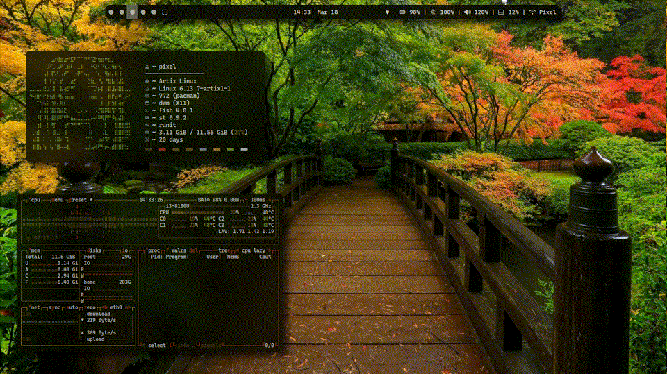

# walrs: Fast Color Scheme Generator

walrs is a fast color scheme generator written in Rust that creates terminal color schemes from images.

[](screenshots/preview.gif)

---

## Shortcuts
- [Features](#features)
- [Installation](#installation)
- [Usage](#usage)
- [Supported Terminals and Applications](#supported-terminals-and-applications)
- [Performance](#performance)

---

## Features
- **Rust-based**: Fast and minimal resource usage
- **Generate terminal color schemes** from images
- **Reload themes instantly**
- **Compatible with pywal templates**
- **Seamless integration** with various terminal emulators and applications

---

## Installation
### From AUR
```bash
yay -S walrs
```

### From Cargo
```bash
cargo install rswal
```

### From Source
```bash
make install
```
The make install command will place all necessary files in their appropriate locations.

---

## Usage

Generate a color scheme from an image:
```bash
walrs -i /path/to/image.jpg
```

Example output:
```
[I] Generate: generate colors.
[I] Template: create templates.
[I] Wallpaper: set the wallpaper.
[I] Terminal: terminal colorscheme set.
[I] Xrdb: xrdb colorscheme set.
[I] Colors: colorscheme applied successfully.
● ● ● ● ● ● ● ● ●
```

---

## Supported Terminals and Applications
walrs is compatible with various terminals and applications through pywal templates:
- sway
- xrdb
- tty
- kitty
- polybar
- And more!

---

## Performance
walrs is designed to be lightweight and fast:
- **Memory usage**: Approximately 3.9MB
- **Processing time**: ~180-300ms to generate and apply a color scheme
- **Dependencies**: Requires an external app to set wallpaper

Example benchmark:
```sh
time walrs -i /home/pixel/.config/wallpaper/wallhaven-ymwj9d.jpg
[I] Generate: generate colors.
[I] Template: create templates.
[I] Wallpaper: set the wallpaper.
[I] Terminal: terminal colorscheme set.
[I] Xrdb: xrdb colorscheme set.
[I] Colors: colorscheme applied successfully.
● ● ● ● ● ● ● ● ●
________________________________________________________
Executed in  185.80 millis    fish           external
   usr time  119.95 millis    0.56 millis  119.39 millis
   sys time   58.95 millis    1.12 millis   57.82 millis
```
